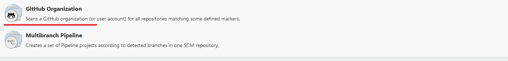

# The Jenkins server

The Jenkins server is the most important section of the current setup. It contains most of the logic behind the benchmarking process.

It has specific configurations to allow the procedure to be as simple as possible.

## Connection to server

To connect to the server, you must have access to the VPN of Polytechnique Montréal. Once connected, you can access the Jenkins server using the following [link](http://frontal22.recherche.polymtl.ca:8080).

## Configuration

Jenkins is an open source CI/CD tool that you can install on most Linux-based systems. It basically works as a server that can be customized by installing plugins. By default, it comes preinstalled with some useful plugins like `Git branch source`, but for this particular setup to work, we need the following plugins:

1. **Generic Webhook Trigger**
2. Branch API
3. Credentials
4. Git
5. Git client
6. **GitHub**
7. **GitHub Branch Source**
8. GitHub Integration Plugin

With all these plugins installed, all that's left is to inject environment variables to Jenkins directly. Since we use SunGridEngine, Jenkins needs to be able to push jobs into the queues. Therefore, it is important to define the relevant variables:

1. `SGE_CELL`
2. `SGE_ROOT` 
3. `GITHUB_AUTH`
4. `PATH+EXTRA`
5. `GKSwstype`

Simply add the variables above by going to `Manage Jenkins`, then `Configure System` and checking the `Environment variables` box.

The first two variables allow Jenkins to push jobs to the SGE queues. The `GITHUB_AUTH` is the github token to authenticate the JSOBot Github account. `PATH+EXTRA` is the PATH variable that contains the **Julia executable**. It is important for this variable to not be named `PATH` as that created issues. The convention is to add the `+EXTRA`, it's a weird workaround, but it works...

All that's left is to configure a pipeline of type `github organization folder`. Simply click on `New Item` and choose that option

## The Jenkinsfile

This file almost all of the logic and all the important configurations. It allows to write your pipeline as code and to have the bulk of your configurations in a single file. This `Jenkinsfile` must abolutely be in each branch that you want to pipeline. Jenkins will not detect your repository if the `Jenkinsfile` is not in the master branch.

This `Jenkinsfile` was written by following the [standard declarative pipeline documentation](https://www.jenkins.io/doc/book/pipeline/syntax/). The configuration of the Generic Webhook Trigger Plugin in the `Jenkinsfile` was heavily inspired by the [plugin documentation](https://github.com/jenkinsci/generic-webhook-trigger-plugin).

The Jenkinsfile accomplishes the following:

1. Clone the repo if it doesn't exist locally.
2. Checkout on the PR branch.
3. Push the job in the SGE queue to execute the benchmarks. 
4. Cleans up the repo. 

When the job is pushed to SGE, it's pushed with all the necessary environment variables to execute the benchmarks. Eventually, the gist of the benchmarks will be pushed to the corresponding pull request.

 
