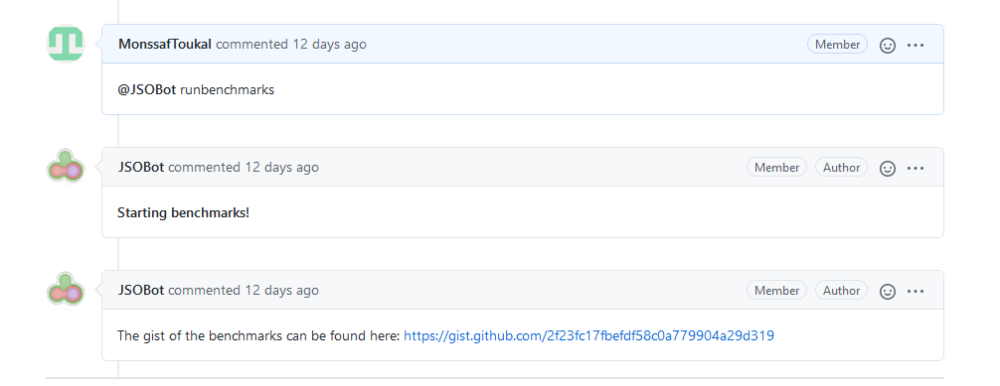
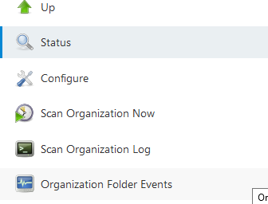
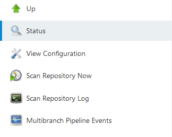
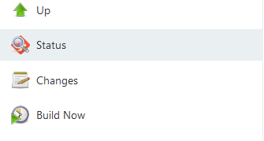

# JSOBot: How to benchmark with ease

JSOBot is the new member of the organization that will be able to benchmark any module of the organization.


## What does it do?

JSOBot's most basic function is to benchmark a repository by comparing a branch to the main. This way, the developers can easily check if the new changes made are having an impact on the performance of the given module.

**The bot will always compare the latest commit of the current branch with the lastest version of the main branch.**

<p align="center">
	

## How do I set it up?

To set up JSOBot on your julia module, simply clone this [repository](https://github.com/ProofOfConceptForJuliSmoothOptimizers/BenchmarkSetup).


Simply run: 

```
cd ~/BenchmarkSetup
julia src/setup_benchmarks.jl --org ${your_organization} --repo ${your_repo} --new_branch ${branch_name} --title {pr_title}
```

To setup the **repository** webhooks, follow [this guide](webhook_setup.md).

If you wish to setup the benchmarks for a GitHub organization or for multiple repositories belonging to the same owner, follow [this guide](org_webhook_setup.md).

`setup_benchmarks.jl` adds all the necessary dependencies to the `Project.toml`.

### Jenkinsfile
The `Jenkinsfile` is the file that describes the CI/CD pipeline of a specific branch. For a build to be triggered, you must:

- Make sure the field `token:` in your Jenkinsfile contains the name of your repository without the `.jl` at the end.

That way, Jenkins knows which pipeline to run.  


## How do I run my benchmarks?

First, make sure you have a pull request containing all your commits. 

Make sure you have all the necessary files on your branch and on the main branch and that the webhook is correctly configured. [See here](webhook_setup.md).  

**Verify that the `token` variable in the Jenkinsfile has the same value as the token in the payload url of the webhook.**

After connecting to the Jenkins server, make sure that you see your repository. If you can't find it, click on the `Scan Organization Now`.

<p>
    
</p>

After clicking on your repository, you should be able to see your branch. If you don't, simply click on `Scan Repository Now`.

<p>
    
</p>

After clicking on your branch, make sure to run the **first** build manually by clicking `Build Now`. Only the first build has to be run manually.

<p>
    
</p>

Now, you can run the benchmarks by commenting on your PR:

"@JSOBot runbenchmarks"

Give it some time and it should respond with another comment. Eventually, it will post a link to a gist containing the results! 

## Prerequisites

To benchmark a module, some requirements need to be met. Some files are required for it to work properly.

All the necessary files can be found [here](https://github.com/ProofOfConceptForJuliSmoothOptimizers/BenchmarkSetup)!
 
Here are the files required **at the base of your repository AND at the branch you want to benchmark**:

1. A `Jenkinsfile` needs to be in the main branch.
2. A `Jenkinsfile` needs to be in the branch you want to benchmark (different than main).
3. A bash script called `push_benchmarks.sh`.

It is necessary for a module to have a `benchmark` folder. That folder needs to contain some specific files: 

1. `benchmarks.jl` to define the how to benchmark the module.
2. `run_benchmarks.jl` to run the benchmarks.
3. `send_comment_to_pr.jl`. This script is what sends the results of the benchmarks to the pull request.

Here is an example of a module with the necessary files and structure: [AMD.jl](https://github.com/JuliaSmoothOptimizers/AMD.jl).

For all these scripts to work, you need to add some modules to `benchmark/Project.toml`.

If you wish to add these modules manually, execute the following in the julia REPL:

```
using Pkg
Pkg.activate("REPO_PATH/benchmark")
Pkg.add(["PkgBenchmark", "BenchmarkTools", "JLD2", "DataFrames", "ArgParse", "Git", "GitHub", "JSON", "Plots", "SolverBenchmark"])
```
`REPO_PATH` should be the relative or absolute path of the root folder of your repository (e.g `./MyModule.jl`).

JSOBot also requires a webhook to be set up for the repository that needs to benchmarked. You can set up the webhook manually [here](webhook_setup.md).


