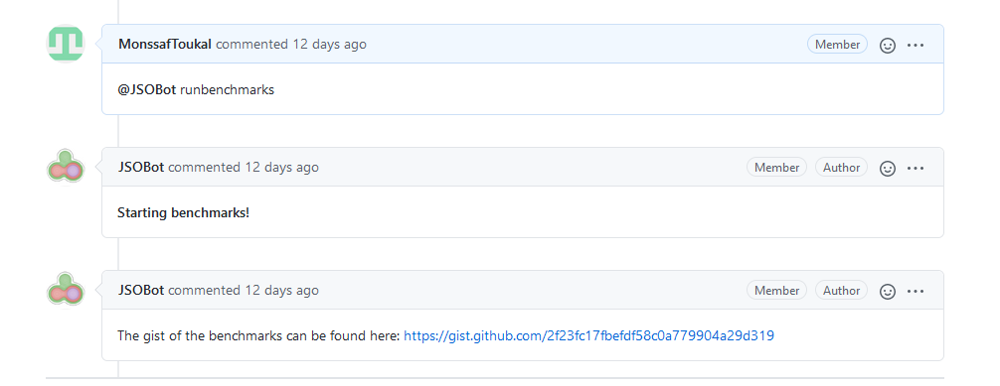

# Benchmark Bot Architecture

The benchmark bot allows to benhmark any module by simply commenting on a Pull Request. Here is a simple overview:


After a the job is completed, a julia script script is executed by the computing cluster that calls the GitHub API and sends the url of the gist containing all the relevant informations:




## Issues

As of now, although it is possible to compare a branch with the master branch for a given repository, there is an issue with the approach taken.

### Multiple Job Triggered

The problem with using GitHub Webhooks is that they map to a **repository** and not a branch of a repository. Therefore, if a given repository has two active Pull Requests and one of them triggers a build, the other one will still be triggered and its gist will be pushed to the wrong PR. This is a problem that needs to be fixed.

### Multiple Job Triggered: Solution

The best solution would be to change the value of these variables in the `Jenkinsfile`:

```
regexpFilterText: '$BRANCH_NAME $comment',
regexpFilterExpression: '{Your target branch here} @JSOBot runbenchmarks'
```

`$BRANCH_NAME` is a Jenkins variable that takes the name of the branch being built as a value. Replace `{Your target branch here}` with your target branch name. This should fix the problem, but it adds more overhead on the user. The user already has to manually change the token name to the name of the repository. With this solution, the user now has to change this line in all `Jenkinsfile` to make sure it doesn't trigger many builds.

Here is an example: 

```
token: "${Your token here (e.g Krylov)}",

printContributedVariables: true,
printPostContent: true,

silentResponse: false,

regexpFilterText: '$BRANCH_NAME $comment',
regexpFilterExpression: '{your branch name} @JSOBot runbenchmarks'

```
`$BRANCH_NAME` is an environment variable used by Jenkins that stores the name of the branch being built. Replace `{your branch name}` by the name of your branch. Lastly, make sure this Jenkinsfile is in the correct branch (i.e the same branch you want to build).