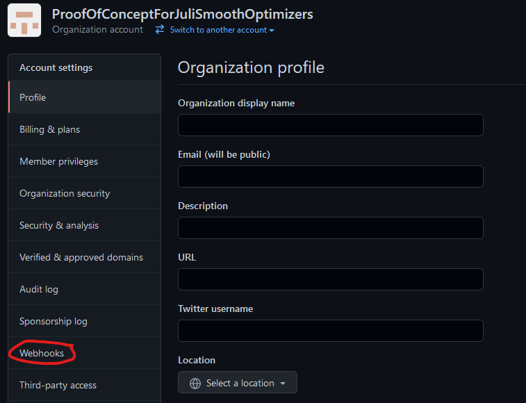
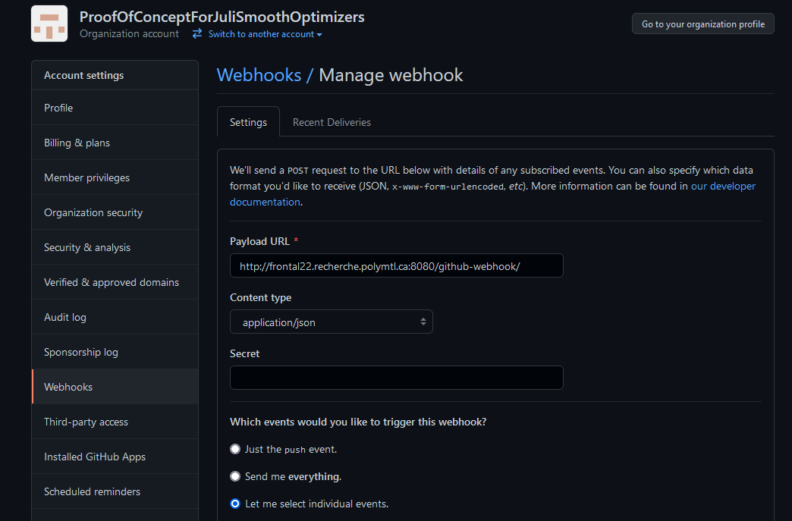

## Webhook setup for a GitHub Organization/Owner

There are two webhooks to add to setup the benchmarks correctly:

1. PR/Repo creation webhook.

2. Issue comment webhook.

### PR/Repo creation webhook

The PR/Repo creation webhook notifies the Jenkins server that a new PR/repository exists while the second webhook is the one that triggers the benchmarks.

The first webhook has to be set up for the whole organization. Here are the following steps:

1. Go on the **Settings** tab of the Organization folder and click on the **Webhooks** tab.

    

2. Click on the **Add webhook** button and you will be redirected on this page:
    
    

3. Fill all the necessary information:

* In  **payload URL** , add the following address: http://frontal22.recherche.polymtl.ca:8080/github-webhook/

* In the **Content Type** , choose the **application/json** option.

4. Choose **Let me select individual events** and select the following: 
	*  Pull requests
    *  Repositories

5. Click on **Update webhook/Add webhook** and you are done!

### Issue comment webhook

This webhook **must** be added to repositories individually. To do so, follow [this guide](webhook_setup.md).